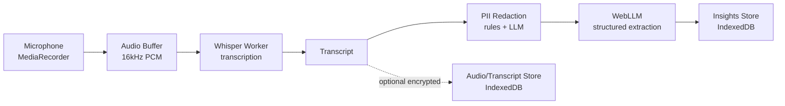

# Door Knocking Notes — Implementation Plan

## 1. Vision

A privacy-first, cross-browser smartphone web app (PWA) for political door knockers.
It records audio of doorstep conversations, transcribes speech to text **entirely on-device**,
and uses a **local LLM** to extract structured insights (voting intention, key issues)
while stripping personally identifiable information (PII). **No data ever leaves the device.**

## 2. Hard Constraints (Non-Negotiable)

| Constraint | Rationale |
|---|---|
| 100% local processing | Legal/ethical requirement: no cloud, no analytics, no telemetry |
| Cross-browser (iOS Safari, Android Chrome) | Door knockers use their own phones |
| Runs as a web app (PWA) | No app-store distribution friction; installable to home screen |
| Offline-capable after first load | Canvassing happens in areas with poor signal |
| PII stripped before storage/analysis | Only non-identifying insights are retained |

## 3. Tech Stack

| Layer | Choice | Notes |
|---|---|---|
| App shell | Vanilla TS + Vite (or Preact if UI grows) | Keep bundle tiny; PWA plugin (`vite-plugin-pwa`) |
| Audio capture | `MediaRecorder` API (`getUserMedia`) | Fallback mime-type negotiation: `audio/webm;codecs=opus` → `audio/mp4` (iOS) |
| Transcription | [whisper-web / transformers.js](https://github.com/xenova/whisper-web) (`@xenova/transformers`) | Whisper `tiny`/`base` quantized ONNX in a Web Worker, WASM backend (WebGPU where available) |
| Local LLM | [WebLLM](https://github.com/mlc-ai/web-llm) (`@mlc-ai/web-llm`) | Small model (e.g. Phi-3-mini / Llama-3.2-1B/3B) via WebGPU; WASM fallback where possible |
| Storage | IndexedDB (`idb`) | Audio blobs (optional), transcripts, extracted insights |
| PII handling | Rule-based redaction + LLM prompt constraints | Defence in depth, see §7 |

## 4. Architecture



**Key architectural decisions**

- **Web Workers everywhere heavy**: Whisper runs in a dedicated worker; WebLLM already runs off-main-thread. Main thread stays responsive for recording UI.
- **Model caching**: Models (Whisper ~40–80 MB quantized, LLM ~1–2 GB) are downloaded once, then served from Cache Storage / IndexedDB. First-run requires Wi-Fi; afterwards fully offline.
- **Progressive enhancement**: Detect WebGPU → WASM SIMD → WASM baseline. Degrade model size accordingly and warn the user.
- **No backend**: Static hosting only (GitHub Pages / Netlify). This *is* the security model.

## 5. Feature Breakdown

### 5.1 Session Recording
- Start/stop recording per doorstep visit; sessions grouped into "canvassing runs".
- Chunked recording (e.g. 30 s segments) so a crash loses at most one chunk.
- Lock-screen / background behaviour on mobile is limited — document "keep screen on" guidance; consider Wake Lock API.
- Visual indicator that recording is active (required for two-party-consent jurisdictions).

### 5.2 On-Device Transcription
- Feed recorded chunks to Whisper (16 kHz mono) in a worker.
- Show incremental transcript during/after the session.
- Model picker: `whisper-tiny` (fast, rough) vs `whisper-base` (default) — trade-off shown to user.

### 5.3 LLM Extraction
Structured extraction prompt → strict JSON output (guided/JSON-schema mode in WebLLM):

```json
{
  "party_support": "labour|conservative|libdem|green|other|undecided|not_stated",
  "key_issues": ["nhs", "cost_of_living", "housing"],
  "sentiment": "supportive|leaning|undecided|hostile",
  "follow_up_requested": false,
  "notes": "short non-identifying summary"
}
```

### 5.4 PII Stripping (see §7)
### 5.5 Session Review & Export
- List of past sessions with extracted insights (not raw PII).
- Aggregate view: issue frequency, party split across a run.
- Export insights as CSV/JSON; **raw audio/transcripts exportable only behind an explicit, warned action** (data-controller responsibility).

## 6. Data Model (IndexedDB)

| Store | Contents | PII? |
|---|---|---|
| `sessions` | id, startedAt, duration, status, model versions | No |
| `audioChunks` | sessionId, seq, blob, duration | **Yes** — optional retention, auto-delete after transcription (default) |
| `transcripts` | sessionId, text (post-redaction), createdAt | Should be No — redacted before write |
| `insights` | sessionId, extraction JSON, createdAt | No by design |

## 7. Privacy & Security Plan

1. **PII redaction before persistence**
   - Rule-based pass first: names ("my name is X"), addresses (house numbers, postcodes), phone numbers, emails via regex/NER-style patterns.
   - LLM extraction prompt instructs the model to never emit names/addresses and to output only the schema fields.
   - Transcript stored only **after** redaction; raw transcript exists in memory only.
2. **Audio retention**: default = delete audio immediately after successful transcription. Toggleable per-org policy.
3. **Data at rest**: IndexedDB is per-origin; document device-encryption/OS-passcode reliance. Optional passphrase encryption (WebCrypto AES-GCM) for stored data.
4. **Consent UX**: recording banner + spoken-consent prompt script displayed to the canvasser.
5. **No network at runtime**: after model caching, assert zero network calls (CSP `connect-src 'self'` + service worker audit).
6. **CSP + permissions**: strict CSP; only `microphone` permission requested.

## 8. Milestones

| # | Milestone | Deliverable |
|---|---|---|
| M1 | Scaffold | Vite + TS + PWA shell, installs offline, mic permission flow |
| M2 | Recording | MediaRecorder sessions, chunking, IndexedDB storage, playback |
| M3 | Transcription | Whisper worker, model download/cache UX, incremental transcript |
| M4 | Extraction | WebLLM integration, JSON-schema extraction, insight cards |
| M5 | PII hardening | Redaction pipeline, audio auto-delete, encryption option, CSP lockdown |
| M6 | Polish | Aggregates, CSV export, battery/perf tuning, field testing |

## 9. Testing Strategy

- **Unit**: redaction rules (golden PII corpus), schema validation of LLM output (retry/malformed handling).
- **Integration**: record → transcribe → extract pipeline with canned audio fixtures (run headless in Playwright on Chromium + WebKit).
- **Device matrix**: iOS Safari (latest − 1), Android Chrome (latest − 1); low-RAM Android is the binding constraint for the LLM.
- **Privacy audit**: service-worker network interception test proving zero third-party requests during a full session.

## 10. Risks & Mitigations

| Risk | Impact | Mitigation |
|---|---|---|
| LLM model too large for low-end phones | Extraction fails on device | Tiered model list; allow transcription-only mode with extraction deferred to a stronger device |
| WebGPU absent (older iOS) | Slow/failed LLM inference | WASM fallback; feature-detect and communicate clearly |
| Background recording killed by OS | Lost audio | Wake Lock + foreground-service-like UX guidance; chunking limits loss |
| Whisper accuracy on doorstep noise | Poor transcripts | `base` model default; optional VAD pre-filter; manual transcript edit UI |
| PII leaks into stored text | Legal breach | Redact-before-write, defence-in-depth, audit log of redactions, never store raw |
| Legal consent variance by jurisdiction | Compliance issue | In-app consent script + admin-configurable jurisdiction notice |

## 11. Open Questions

- Which LLM ships as default given the ~2 GB WebLLM download? (Field-test Phi-3-mini vs Llama-3.2-1B.)
- Is audio ever retained (e.g. for dispute resolution), and under what retention window?
- Multi-language support beyond English for transcription/extraction?
- Who is the data controller, and what is the deletion workflow if a resident requests it?
